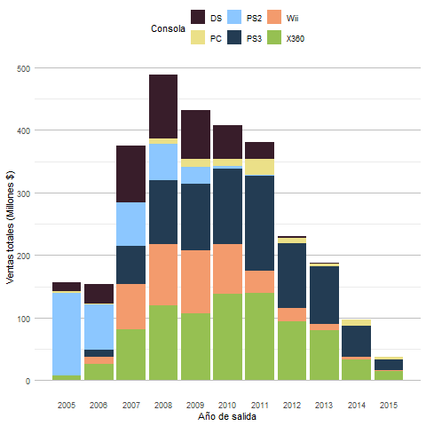

# Visualización de ventas de videojuegos en los años 2005-207 para las distintas plataformas

## Stacked Barplot Videogames Sales

    
    

Se aprecia un stacked barplot sobre las ventas en millones de USD de videojuegos entre los años 2005-2017 dividido en las principales consolas de la época.
